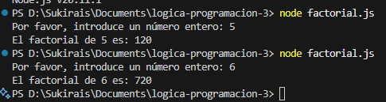
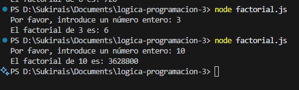
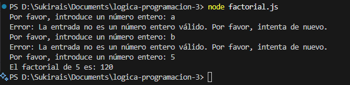

# logica-programacion-3

Práctica de Factorial: El script interactúa con el usuario en la consola para obtener un número entero, calcula su factorial y muestra el resultado, a la vez que se asegura de que la entrada sea válida antes de realizar el cálculo.

Entrada:
5
Salida: 120.

Entrada:
6
Salida: 720.

Otras pruebas:

Entrada:
3
Salida: 6.

Entrada:
10
Salida: 3628800.

Identificando si el dato de entrada es de tipo number, en caso contrario debe mandar un mensaje de error y volver a solicitar el dato.

Entrada:
a
Salida: Error: La entrada no es un número entero válido. Por favor, intenta de nuevo.

Entrada:
b
Salida: Error: La entrada no es un número entero válido. Por favor, intenta de nuevo.

Entrada:
5
Salida: 120.

